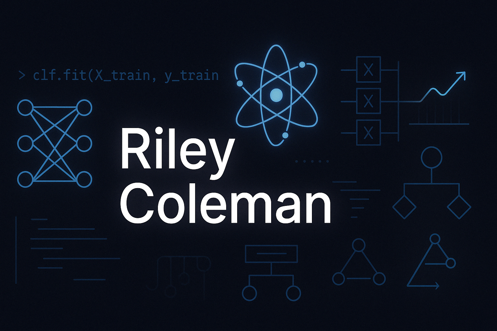

# Hey, I'm Riley Coleman 👋

I'm a master's student in **Health Data Science at UCL**, passionate about using machine learning, AI, and quantum computing to solve real-world problems in health and biotech. I’m especially interested in building foundational tech — from AI models to quantum pipelines — and exploring ways to make them fair, scalable, and impactful.

---

## Current Focus
-  Master's thesis: ML analysis of osteoarthritis as a comorbidity for atrial fibrillation outcomes
-  Studying quantum computing through MIT xPro + Qiskit
-  Developing machine learning models with Python, R, and SQL
-  Exploring AI in biotech and health (especially outside imaging)
- 

---

## Tech Stack
- **Languages**: Python, R, SQL, Java  
- **Frameworks**: scikit-learn, XGBoost, Qiskit, pandas, NumPy, Matplotlib  
- **Tools**: Jupyter, Git, VS Code, Kaggle  
- **Concepts**: ML modeling, unsupervised clustering, algorithmic bias, quantum circuits, predictive analytics

---

## Featured Projects

### [AF-OA-ML-Analysis](https://github.com/rileyq7/AF-OA-ML-Analysis)
Machine learning analysis of osteoarthritis as a comorbidity in atrial fibrillation outcomes using statistical, supervised, and unsupervised models. Work-in-progress repository from my master’s thesis.

### [Heart Disease Machine Learning Prediction](https://github.com/rileyq7/heart-disease-ml)
A mini-workshop project exploring quantum use cases in health, like simulating molecular interactions and accelerating ML optimization with quantum-enhanced methods.

### [Kaggle AI Playground](https://github.com/rileyq7/kaggle-ai-playground)
Personal space for experimenting with Kaggle competitions, exploring ensemble models, preprocessing pipelines, and fairness-aware ML.

---

## Let’s Connect!

- 💼 [LinkedIn](https://www.linkedin.com/in/riley-coleman-4614061b3/)
- 📧 [rileyq12@gmail.com](mailto:rileyq12@gmail.com)

---

_“Build things that matter. Learn deeply. Share openly.”_
