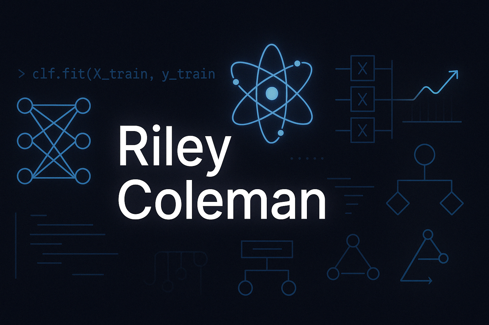

# Hey, I'm Riley Coleman 👋

Founding engineer at Pitchwits, building agentic infrastructure for grant discovery and R&D funding. Based in London.
What I'm working on

Pitchwits platform — full-stack agentic search, RLHF pipeline, and consortium-matching across 150k+ organisations. Most of my recent commits live here (private).
Dendric — research-side project. A biologically-inspired memory lifecycle primitive for LLM agents. Benchmarking against LongMemEval.

Interests
Agent memory, evals, interpretability. Reading lately on emergent gravity and PBH dark matter on the side, mostly for fun.
Background
UCL MSc Health Data Science. First-author manuscript on a ~260k-patient EHR cohort (CALIBER). Previously AI/ML at Projects by IF on responsible AI evaluations, then Principal AI Engineer at Ailsa.

Reach me
https://www.linkedin.com/in/riley-coleman-4614061b3/· rileyq12@gmail.com
